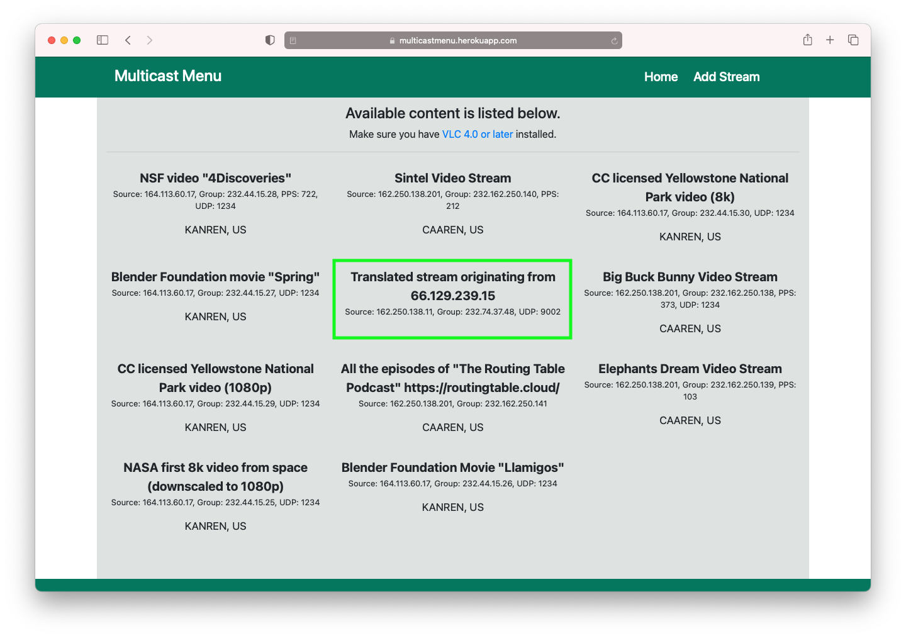

# unicast2multicast-translator

## Background & Goal
This project is part of a larger effort called 
[Multicast to the Grandma](https://datatracker.ietf.org/meeting/104/materials/slides-104-mboned-mttg-01) (MTTG).
Put briefly, the goal of MTTG is to bring applications that rely on multicast infrastructure to users in networks that 
do not support multicast.
The key idea is to automatically translate unicast traffic to multicast traffic as the traffic enters a 
multicast-enabled network from a unicast-only network, and vice versa when the traffic enters a unicast-only network 
from a multicast-enabled network.
So far, the latter (multicast to unicast translation) has been achieved using 
[Automatic Multicast Tunneling](https://datatracker.ietf.org/doc/html/rfc7450) (AMT), which, as the name suggests, 
essentially tunnels multicast traffic by wrapping it in unicast packets when the traffic leaves the multicast-enabled 
network, such that the traffic can travel across the unicast-only network and ultimately be unwrapped by the receiving 
end host.

While AMT allows for delivery of content originating from (and sent as multicast) a host in a multicast-enabled network
(e.g., the [Multicast Backbone](https://en.wikipedia.org/wiki/Mbone) (Mbone)) to receivers in unicast-only networks, it
does not provide unicast-to-multicast translation, as stated in the February 2015 revision of the
[RFC](https://datatracker.ietf.org/doc/html/rfc7450#section-2):

> This document does not describe any methods for sourcing multicast traffic from isolated sites, as this topic is out 
> of scope.

A different solution is therefore needed to enable a host in a unicast-only network to source content intended for 
multiple recipients in multicast-enabled networks (and/or in unicast-only networks where there is a multicast-enabled 
transit network with AMT support between the source and the receiver).
The goal of this project is to develop a service that performs unicast-to-multicast translation to enable such 
unicast-only sources to utilize the multicast capabilities of the (transit) multicast-enabled networks between the 
source and its receivers.

## Python Version
The code is written in Python 3. We have successfully deployed the translator in our test environment using Python 
v3.7.3.

## Dependencies
The code relies on the following third-party libraries:
- [`requests`](https://github.com/psf/requests)

## Usage
The default configuration should suffice for most use cases, so simply do:
```
$ python3 translator.py
Press enter to terminate the translator...
read timeout: nothing to be translated this iteration
read timeout: nothing to be translated this iteration
...
Multicast address (232.74.37.48, 9002) allocated for ('66.129.239.15', 31380).
Added amt://162.250.138.11@232.74.37.48:9002 to the Multicast Menu (email=lenny@juniper.net; description=Translated stream originating from 66.129.239.15).
```
Once the translator is running, you can terminate it by pressing enter. The translator will report a read timeout at
periodic intervals (currently set to 5 seconds) as long as it is not receiving any unicast packets for translation.
This is *not* an error, but rather an indication that the translator is alive and well and simply waiting for clients
to start sending unicast streams for translation.

Whenever a packet pertaining to a previously unseen unicast flow arrives (packets are mapped to flows using their source
IP and source port), the translator will randomly pick a multicast address and reserve it for that new flow.
This initial unicast packet, and any subsequent unicast packets pertaining to that same flow, will then be translated to
multicast packets with a destination IP matching the multicast address that was reserved for the unicast flow.
The translator will also add information about the new stream to the
[Multicast Menu](https://multicastmenu.herokuapp.com).
An example of what these entries will look like is provided in the screenshot below.



### Command Line Interface
A set of CLI options are available if you want to configure what IP address to listen for unicast flows on, what 
multicast address space to randomly pick multicast addresses from (when assigning a multicast address to a new unicast
flow) etc. 
Refer to the CLI help:
```
$ python3 translator.py --help
usage: translator.py [-h] [--unicast-nif-ip UNICAST_NIF_IP]
                     [--unicast-port UNICAST_PORT]
                     [--multicast-addr-space MULTICAST_ADDR_SPACE]
                     [--multicast-port MULTICAST_PORT]

Start a unicast-to-multicast translation service on this machine.

optional arguments:
  -h, --help            show this help message and exit
  --unicast-nif-ip UNICAST_NIF_IP
                        IP address of the network interface to listen for
                        unicast on. The default value is what was determined
                        to be the primary network interface of this machine
                        (i.e., the network interface that has a default
                        route). Note that this address may not be a public
                        address if this machine is behind NAT or a VPN.
                        Default: 162.250.138.11
  --unicast-port UNICAST_PORT
                        Port number to listen for unicast on. Default: 9001
  --multicast-addr-space MULTICAST_ADDR_SPACE
                        Address space to (randomly) pick destination multicast
                        addresses (groups) from for the translated unicast
                        flows. Default: 232.0.0.0/8
  --multicast-port MULTICAST_PORT
                        Port number to use as the destination port when
                        forwarding unicast flows as multicast flows. The same
                        port number will be used for all translated flows.
                        Thus, a translated flow is identified solely by its
                        assigned multicast IP address (group). Default: 9002
```
Note that the default value for `--unicast-nif-ip` is determined dynamically so `python3 translator.py --help` will 
report a different default value for this option on your machine.